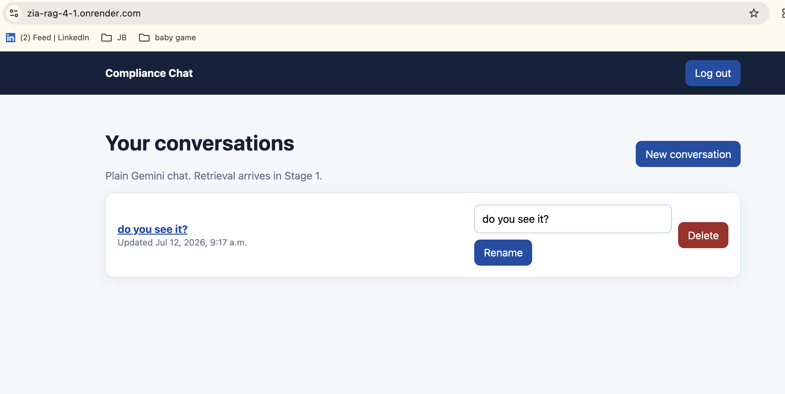

# Stage 0 Proof — App Skeleton and Chat

- **Live URL:** https://zia-rag-4-1.onrender.com/
- **Deployed:** Render (Docker) + managed Postgres, HTTPS.
- **Health check (verified):** `GET /health/` → `{"status": "ok", "database": "ok"}`
- **Login page:** `GET /login/` → HTTP 200

## Acceptance path (verified in browser)

Login → create conversation → chat with Gemini → reload (history persists) →
rename → delete.

## Screenshot

<!-- Save your screenshot of a working conversation as proof/stage-0-chat.png -->
