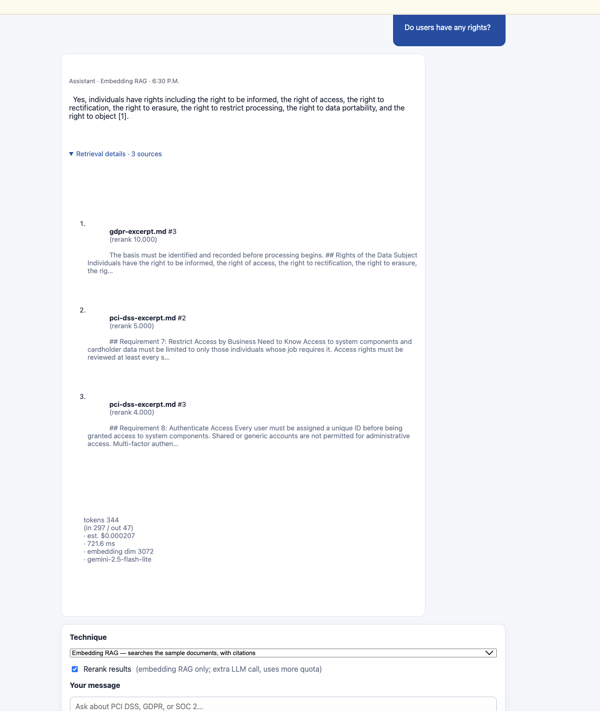

# Stage 1 Proof — Embedding-based RAG

- **Live URL:** https://zia-rag-4-1.onrender.com/
- **What it demonstrates:** ingest → recursive chunking → `gemini-embedding-001` (3072-dim)
  → pgvector → hybrid search (dense + Postgres full-text, fused by RRF) → optional LLM
  reranking → cited answer, all inside the chat via a technique selector.
- **Transparency panel** shows, per answer: retrieved chunks + text, scores + method,
  tokens, estimated cost, latency, embedding dimension, and rerank status.

## How to reproduce

Log in → open a conversation → set Technique = **Embedding RAG** → ask a compliance
question (e.g. "How fast must we report a personal data breach?"). Expand **Retrieval
details** to inspect the machinery. Toggle the **Rerank** checkbox to compare.

## Screenshot

<!-- Save a screenshot of a cited answer + expanded transparency panel as
     proof/stage-1-embedding-rag.png -->
