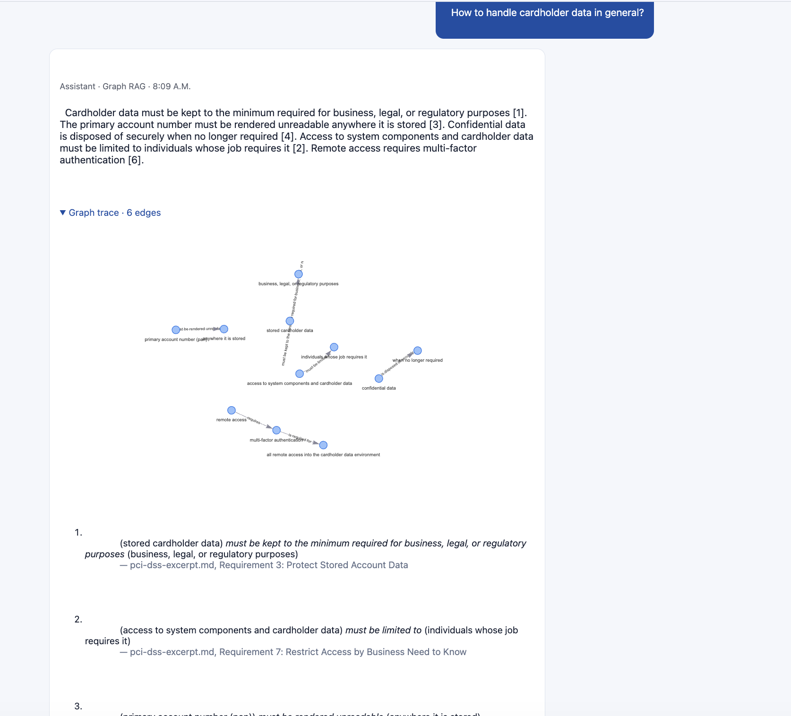

# Stage 2 Proof — Knowledge-Graph RAG

- **Live URL:** https://zia-rag-4-1.onrender.com/
- **What it demonstrates:** LLM extraction of `(subject, predicate, object)` triples from the
  compliance docs → a persisted entity/relationship graph → semantic seed-finding on edge
  embeddings + traversal → a cited answer with a **node/edge trace** and an **interactive
  graph visual**, all inside the chat via the technique selector.
- **Auditability:** every answer shows the exact edges used, each tagged with its source
  document and section.

## How to reproduce

Log in → open a conversation → set Technique = **Knowledge Graph** → ask a relationship
question (e.g. "How fast must a personal data breach be reported, and to whom?"). Expand
**Graph trace** to see the edges used and the interactive graph (drag / zoom the nodes).

## Screenshot

<!-- Save a screenshot of a graph answer with the trace + interactive graph as
     proof/stage-2-knowledge-graph.png -->
