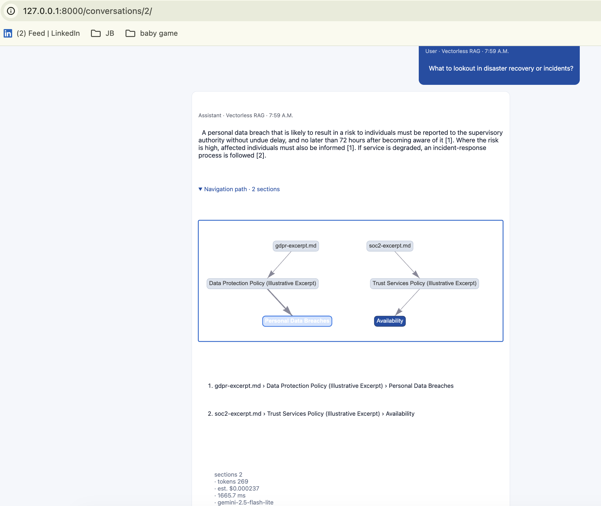

# Stage 3 Proof — Vectorless RAG (reasoning-based)

- **Live URL:** https://zia-rag-4-1.onrender.com/
- **What it demonstrates:** no embeddings, no chunking, no vector store. Each document is
  parsed into a section tree; at query time the LLM navigates the table of contents
  (titles + breadcrumb paths) to pick relevant sections, reads only those, and answers —
  cited to the section path, with the navigation path shown as a highlighted tree.

## How to reproduce

Log in → open a conversation → set Technique = **Vectorless** → ask a question
(e.g. "How quickly must a personal data breach be reported, and to whom?"). Expand
**Navigation path** to see the sections opened and the interactive tree with the chosen
sections highlighted.

## Screenshot

<!-- Save a screenshot of a vectorless answer with the navigation path + tree as
     proof/stage-3-vectorless.png -->
