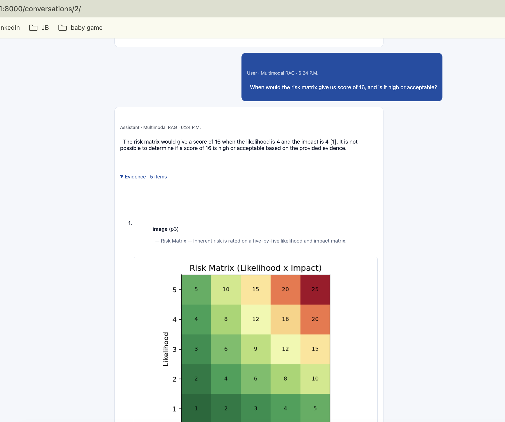

# Stage 4 Proof — Multimodal RAG

- **Live URL:** https://zia-rag-4-1.onrender.com/
- **What it demonstrates:** handling what plain-text RAG misses — tables, charts, and
  equations in a PDF (`sample-docs/compliance-metrics.pdf`). Tables are extracted as
  markdown; figures are embedded as images with `gemini-embedding-2`; a text question
  retrieves text/tables/figures cross-modally and the vision model reads retrieved charts
  to answer. The evidence panel shows the actual figure images used.

## How to reproduce

Log in → open a conversation → set Technique = **Multimodal** → ask a chart-only question,
e.g. "Which security incident category was most common in 2025?" (answerable only from the
bar chart image) or a table question, e.g. "How fast must a Critical incident be notified?".
Expand **Evidence** to see the retrieved text/tables and the inline figure images.

## Screenshot

<!-- Save a screenshot of a multimodal answer with the inline figure evidence as
     proof/stage-4-multimodal.png -->
